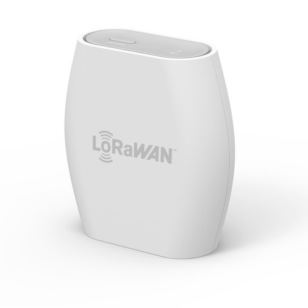
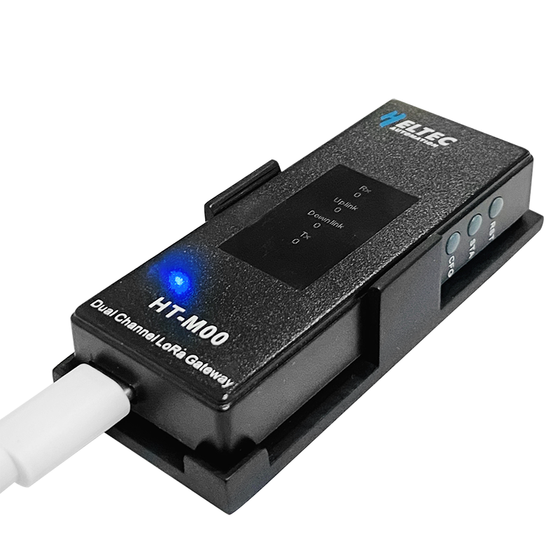
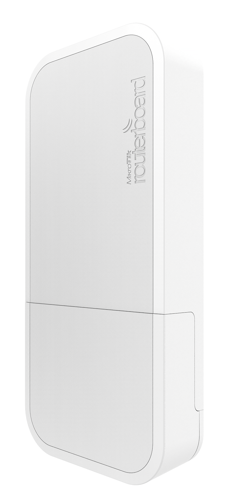

# Gateways

While the [Microcontrollers](microcontroller.md) with an attached LoRaWAN radio
frequency module mostly send data, the receiving part is called gateway.
Essentially it is a device with a LoRaWAN compatible receiver attached as well
as an Internet connection. Received packages are forwarded to a brooker. More
details on that are available in the [LoRaWAN
section](../software/thethingsnetwork.md)

Within this project the following three gateways were used as described below.
This was partly necessary as LoRaWAN coverage with TheThingsNetwork broker were
limited within the area of research, Honolulu, Ohau, Hawaii. At other locations
institutions or private entities may already provide coverage free of charge.
Using the [TTNMapper][ttnmapper] it's possible to see a local coverage map and
determine if a self maintained gateway is required.

## The Things Indoor Gateways

{ align=right width=200px }

This gateway allows simple operation since it's developed by the same people as
the used LoRaWAN broker. It was used during local development and allows quick
migration between different locations. While not waterproof, using additional
casing and attaching an external antenna it can also be used as a outdoor
gateway.

A complete install and maintenance guide is available in the [vendors
documentation][ttig] and is not replicated here.

[ttig]: https://www.thethingsindustries.com/docs/gateways/thethingsindoorgateway/

## Heltec HT-M00

{ align=right width=200px }

Just as the [microcontrollers](microcontroller.md) Heltec offers a development
gateway as [well][m00]. At the time of writing this is the cheapest development
gateway available. The [upstream documentation][m00-docs] guides through the
installation process of the gateway into TheThingsNetwork broker.

## Mikrotik wAP LR9 kit

{ align=right width=150px }

Lastly the outdoor LoRaWAN gateway from the vendor Mikrotik (in [900MHz][900] or
[860MHz][860]) offers the, at the time of writing, cheapest outdoor gateway.
With *Power over Ethernet* (PoE) the installation is possible with a single
Ethernet cable without requiring (ideally elevated) deployment location.

[m00]: https://heltec.org/project/ht-m00/
[m00-docs]: https://heltec-automation-docs.readthedocs.io/en/latest/gateway/ht-m00/connect_to_server.html
[ttnmapper]: https://ttnmapper.org/
[860]: https://mikrotik.com/product/wap_lr8_kit
[900]: https://mikrotik.com/product/wap_lr9_kit
