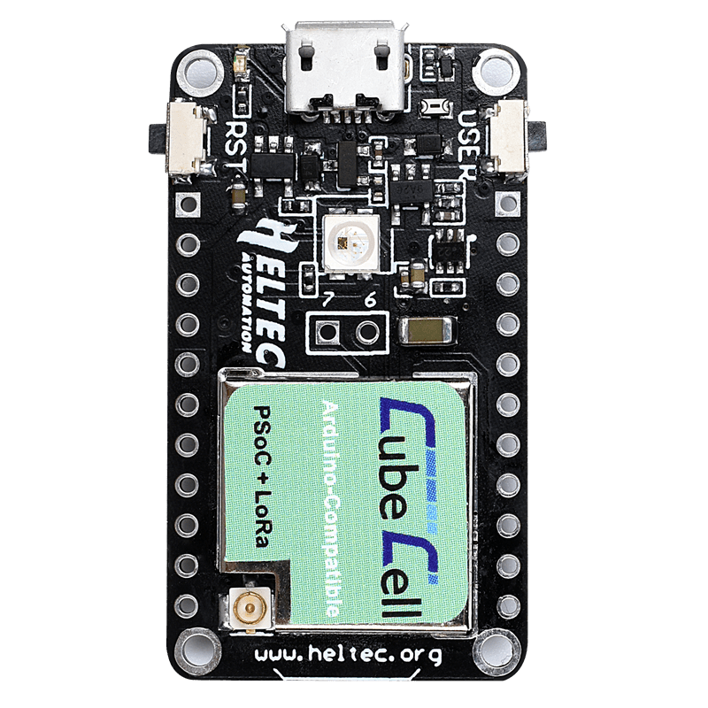
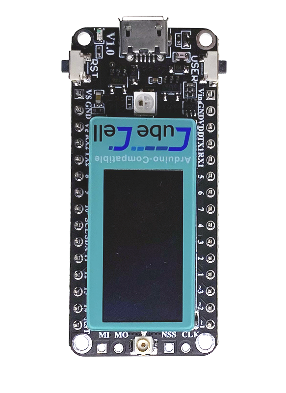

# Microcontroller

This section describes the used microcontrollers and development boards used
within this setup. The microcontrollers is essentially an extremely small
computer with hardware inputs and outputs. In simple terms, sensors are attached
to the inputs and a LoRaWAN radio frequency module is connected to the outputs.

Using microcontrollers comes in two flavors, either as development boards with
populated connectors, for instance a USB port and attached LEDs or as a plain
module, which requires designing of a custom PCB. The former is used for rapid
prototyping while the latter runs on an optimized PCB which only contains
required functionality.

To simplify the development only microcontrollers compatible with the Arduino
framework[^arduino] were considered. The framework abstracts talking to low
level hardware components and offers a simple C API to control the
microcontrollers behaviour. Additionally this allows to migrate code from one
device to another with minimal code modifications sine both devices understand
the same API.

Due to low price and using the LoRaWAN reference implementation the *CubeCell*
product line from the vendor *Heltec Automation*[^heltec]. Both development
boards *CubeCell Dev-Board* (`htcc-ab01`) and *CubeCell Dev-Board Plus*
(`htcc-ab02`) as well as the plain *Module Plus* (`htcc-am02`) were used.

## Heltec CubeCell Dev-Board (Plus)

{ align=right width=400px }
{ align=right width=400px }

The development boards shown on the right both allow to connect sensors via
*GPIO Pins* as well as *I2C*[^i2c] or serial console. Only the bigger *Plus*
versions (bottom) contains two *Analog to Digital converter* (ADC) which are
required for some sensor like the *VH400* moisture sensor.

Additionally the *Plus* version comes with an attached LCD display which can be
used for debugging or additional information during setup. No long time tests
were performed to evaluate the UV resistance of the display.

For outdoor setups they come with a solar charge controller and battery
connector which allows the usage without a constant power supply. 

Both boards use the same microcontroller and can run the same code.

Flashing is trivial by using the USB connection and the
[Platformio framework](../software/platformio.md).

* [Dev-Board Pinout][board-pinout]
* [Dev-Board Plus Pinout][board-plus-pinout]

## Heltect CubeCell Module Plus

{ align=right width=400px }

The *Module Plus* allows (and requires) to use custom PCB and therefore only runs
parts that are required. For production deployments the nodes would not need a
LCD screen for debugging or a USB port for flashing. These components can simply
be removed in the PCB design which reduces the number or parts, thereby cost and
complexity.

*Dev-Board Plus* and *Module Plus* use the same microcontroller and therefore
support the same connections. 

More information on the PCB required for the *Module Plus* is available in the
[PCB](pcb.md) section.

* [Module Plus Pinout][module-plus-pinout]

[board-pinout]: ../resources/static/heltec_htcc-ab01_pinout.pdf
[board-plus-pinout]: ../resources/static/heltec_htcc-ab02_pinout.pdf
[module-plus-pinout]: ../resources/static/heltec_htcc-am02_pinout.pdf
[^arduino]: https://www.arduino.cc/
[^heltec]: https://heltec.org/proudct_center/lora/cubecell/
[^i2c]: https://www.arduino.cc/en/reference/wire
