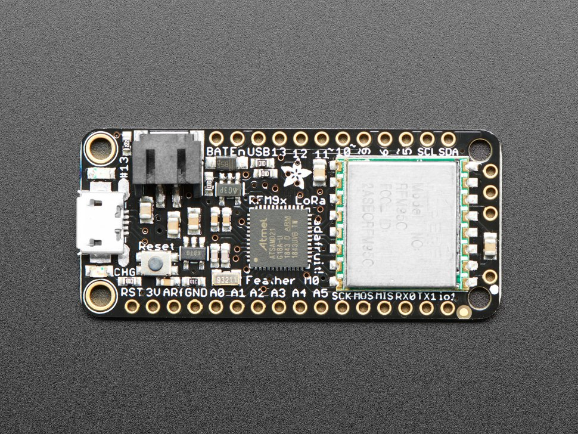

# Adafruit Feather M0

| Source         | Parameter          |
| -------------- | ------------------ |
| Platform (MCU) | SAMD21G18A|
| LoRa chip      | SX1276    |
| Flash          | 256KB               |
| RAM            | 32KB                |
| Deep Sleep     | 300uA               |
| Price          | ~$35                |
| Pinout         | [Link][pinout]     |
| Vendor         | [Link][vendor]     |
| PlatformIO     | [Link][platformio] |

[heltec_wireless_shell]: https://heltec.org/project/wireless-shell/

[pinout]: adafruit_feather_m0_pinout.png

[platformio]: https://docs.platformio.org/en/latest/boards/atmelsam/adafruit_feather_m0.html

[vendor]: https://www.adafruit.com/product/3178
