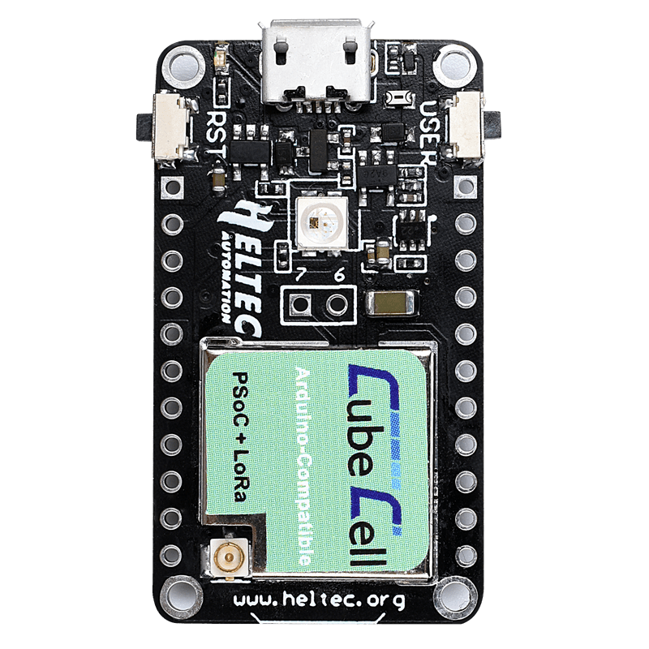

# Heltec CubeCell Dev-Board

The CubeCell Dev-Board is an integrated solution using a new platform called
ASR with the newest generation LoRa chip called SX1262. Instead of the
development board it is also possible to get a PCB compatible
[module][heltec_cubecell_module].

| Source         | Parameter          |
| -------------- | ------------------ |
| Platform (MCU) | [ASR6501][asr6501] |
| LoRa chip      | SX1262 (itegrated) |
| Flash          | 128KB              |
| RAM            | 16KB               |
| Deep Sleep     | 3.5uA              |
| Price          | ~$12               |
| Pinout         | [Link][pinout]     |
| Vendor         | [Link][vendor]     |

[heltec_cubecell_module]: https://heltec.org/project/htcc-am01/

[asr6501]: http://www.asrmicro.com/asrweb_en/products/html/product2_1.html

[pinout]: heltec_cubecell_dev_pinout.pdf

[vendor]: https://heltec.org/project/htcc-ab01/
