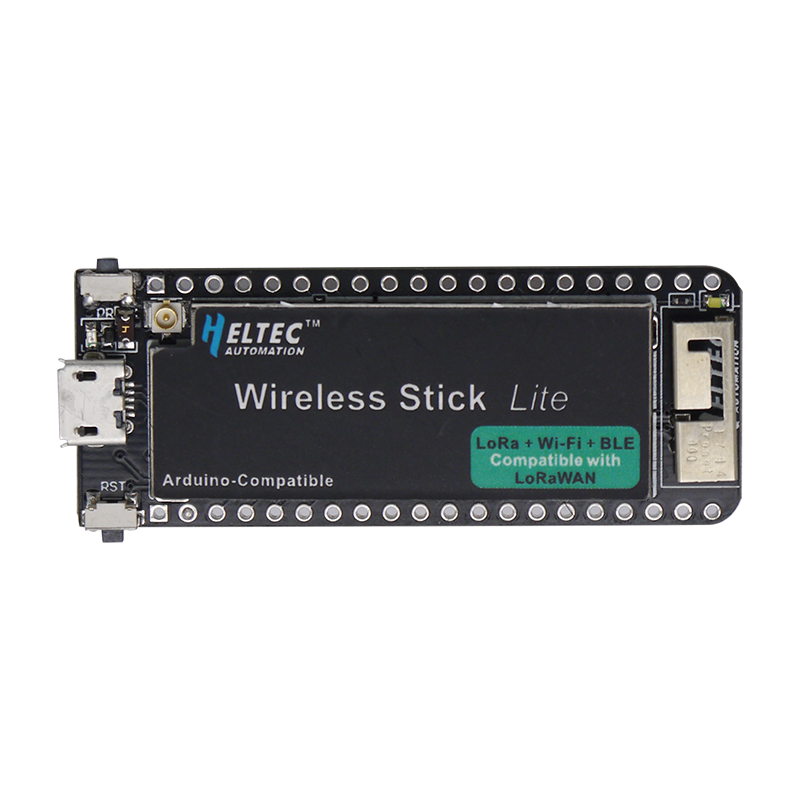

# Heltec Wireless Stick Lite

The _Heltec Wireless Stick Lite_ is a _ESP32_ based development board. The same
hardware is also available as a module called [Wireless
Shell][heltec_wireless_shell].

| Source         | Parameter      |
| -------------- | -------------- |
| Platform (MCU) | ESP32          |
| LoRa chip      | SX1276         |
| Flash          | 4MB            |
| Deep Sleep     | 30uA           |
| Price          | ~$15           |
| Pinout         | [Link][pinout] |
| Website        | [Link][vendor] |

[heltec_wireless_shell]: https://heltec.org/project/wireless-shell/

[pinout]: heltec_wireless_stick_lite_pinout.pdf

[vendor]: https://heltec.org/project/wireless-stick-lite/
