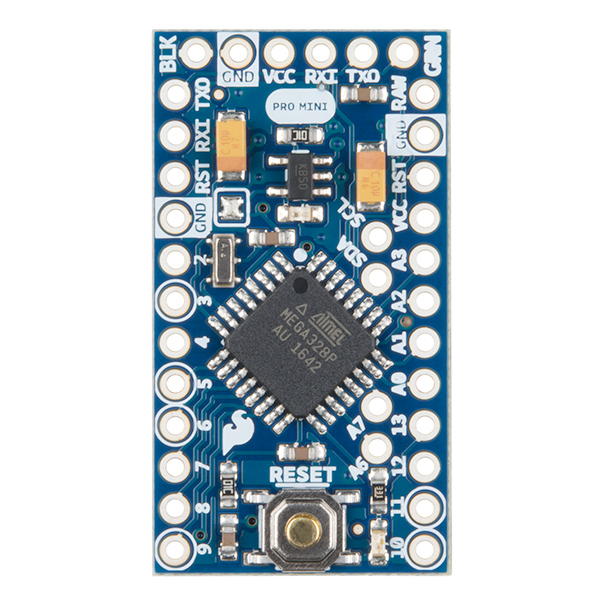

# Sparkfun Pro Mini

The Pro Mini does not come with an attached LoRa antenna, however it is easily
possible to hook up a SX1276 antenna.

| Source         | Parameter          |
| -------------- | ------------------ |
| Platform (MCU) | ATMEGA328P         |
| LoRa chip      | SX1276 (extern)    |
| Flash          | 30KB               |
| RAM            | 2KB                |
| Deep Sleep     | 30uA               |
| Price          | ~$3                |
| Pinout         | [Link][pinout]     |
| Vendor         | [Link][vendor]     |
| PlatformIO     | [Link][platformio] |

[heltec_wireless_shell]: https://heltec.org/project/wireless-shell/

[pinout]: sparkfun_pro_mini_pinout.pdf

[platformio]: https://docs.platformio.org/en/latest/boards/atmelavr/pro16MHzatmega328.html

[vendor]: https://www.sparkfun.com/products/11113
