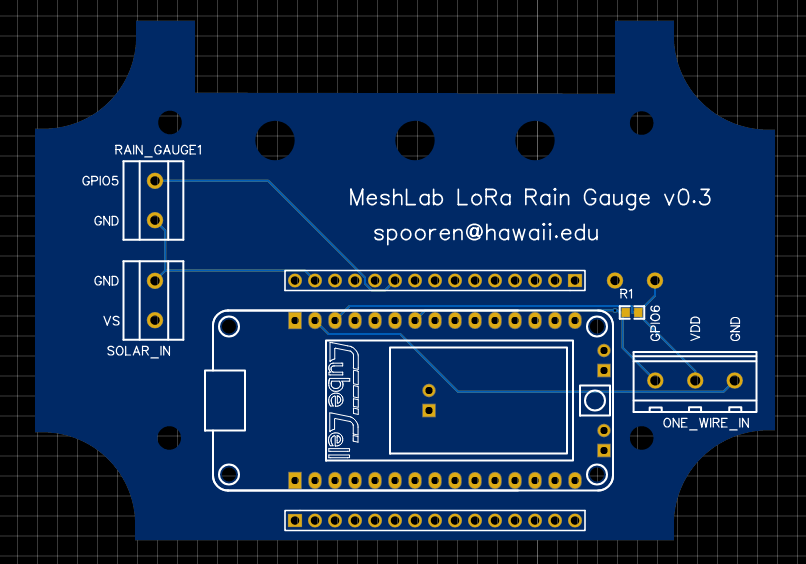
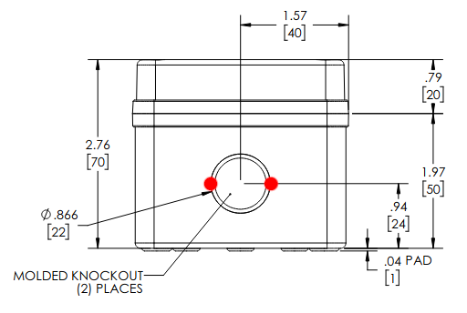
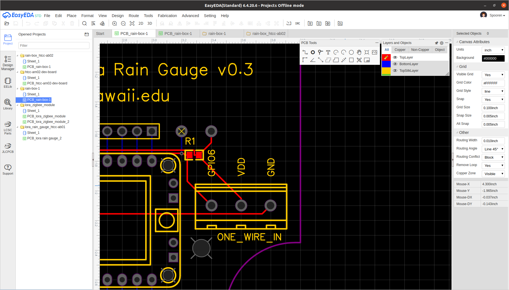

# Printed Circuit Board

This section briefly describes the PCBs designed within this project. While
[breadboards][bread] are often used for prototyping with microcontroller, real
deployments should use custom PCBs since they offer a more reliable setup.

The project scope required a rain gauge sensor as well as a temperature sensor
to transmit measurements over LoRaWAN to a online database. With the below
described PCB it is possible to attach a *Heltec HTCC-AB02* as well as the two
sensors within minutes. 

## *Rain Box* PCB

{ align=right width=400px }

As mentioned above the two values *temperature* and *rain fall* were to be
collected and send to an online database. First prototypes using a breadboard
and a *Heltec HTCC-AB02* worked out as expected, so the same exact circuit was
transfered in a PCB. On the right side a picture of the PCB is shown. The labels
`RAIN_GAUGE`, `SOLAR_IN` and `ONE_WIRE_IN` contain screw terminals which allow
easy attaching of the sensor cables.

An [EasyEda][easyeda] project file is available
[here](../resources/static/rain-box_htcc-ab02-v0.3.zip) for customization or
ordering online.

Additionally the *BOM*, *Gerber* and *Pick & Place* files are available:

* [BOM_PCB_rain-box_htcc-ab02.csv](../resources/static/BOM_PCB_rain-box_htcc-ab02.csv)
* [Gerber_PCB_rain-box_htcc-ab02.zip](../resources/static/Gerber_PCB_rain-box_htcc-ab02.zip)
* [PickAndPlace_PCB_rain-box_htcc-ab02.csv](../resources/static/PickAndPlace_PCB_rain-box_htcc-ab02.csv)

The PCB has a custom cutting so it fits perfectly into the outdoor case
[PTK-18420-C][case] by *Bud Industries, Inc.*. It is important to order the `C`
version since a **clear cover** is required to allow solar charging. Using cable
glands it's possible to connect external sensors. The picture below shows two
possible positions for `7mm` holes to attach `PG7` cable glands. Silicon was
added around the cable glands for better long term water resistance.

The full box specifications are available on the [vendors website][case] or as
an attached [resource](../resources/static/box_hbptk18420.pdf).

It is possible to use the *Pick and Place* file to
order all parts soldered on or solder all components manually. In that case a
`4.7K` resistor should be added on the bottom left instead of a flat resistor.

A picture of an assembled *Rain Box* is shown below. The picture shows four
different setups of the rain gauges. 

* The **left box** has a [HOBO RG3 rain gauge][hobo]
* The **middle box** has only a [DS18B20 temperature sensor] is connected inside
  the box. This was done to measure the maximum daily temperature inside the
  box.
* The **right box** has both a temperature sensor and a [MISOL rain
  guage][misol] attached. By the time of writing (2021-09-16) the official
  vendor website is unreachable.
* In **front** is a PCB board without a box showing a connected *Heltec
  HTCC-AB02*.

## PCB Editor

To design PCBs a variety of tools is available for free. However the number of
tools that are available on the three main platforms Windows, MacOSX and Linux
is limited. Within this project EasyEda[^easyeda] was used for it's simple usage
and integration with part libraries, which would simplify the ordering process.

EasyEda comes with a tight integration of the PCB vendor *JLCPCB* which offers
both creation of PCBs and also soldering of selected components. 

An extensive official documentation is available in English on the [vendors
website][easyeda-docs] include [video tutorials][easyeda-video].

If EasyEda is not an option the open source tools [LibrePCB][librepcb] or
[KiCad][kicad] could be used instead, however they are not covered here.

[bread]: https://en.wikipedia.org/wiki/Breadboard
[easyeda]: easyeda.com/
[case]: https://www.budind.com/product/nema-ip-rated-boxes/ptk-series-fiberglass-box/ptk-18240-2/#group=series-products&external_dimensions_group=0&internal_dimensions=0&cover_style_group=0
[hobo]: https://www.onsetcomp.com/products/data-loggers/rg3/
[ds18b20]: https://www.adafruit.com/product/381
[misol]: https://www.amazon.com/MISOL-Spare-weather-station-measure/dp/B00QDMBXUA/
[librepcb]: https://librepcb.org/download/
[kicad]: https://www.kicad.org
[easyeda-docs]: https://docs.easyeda.com/en/FAQ/Editor/index.html
[easyeda-video]: https://www.youtube.com/channel/UCRoMhHNzl7tMW8pFsdJGUIA/videos
