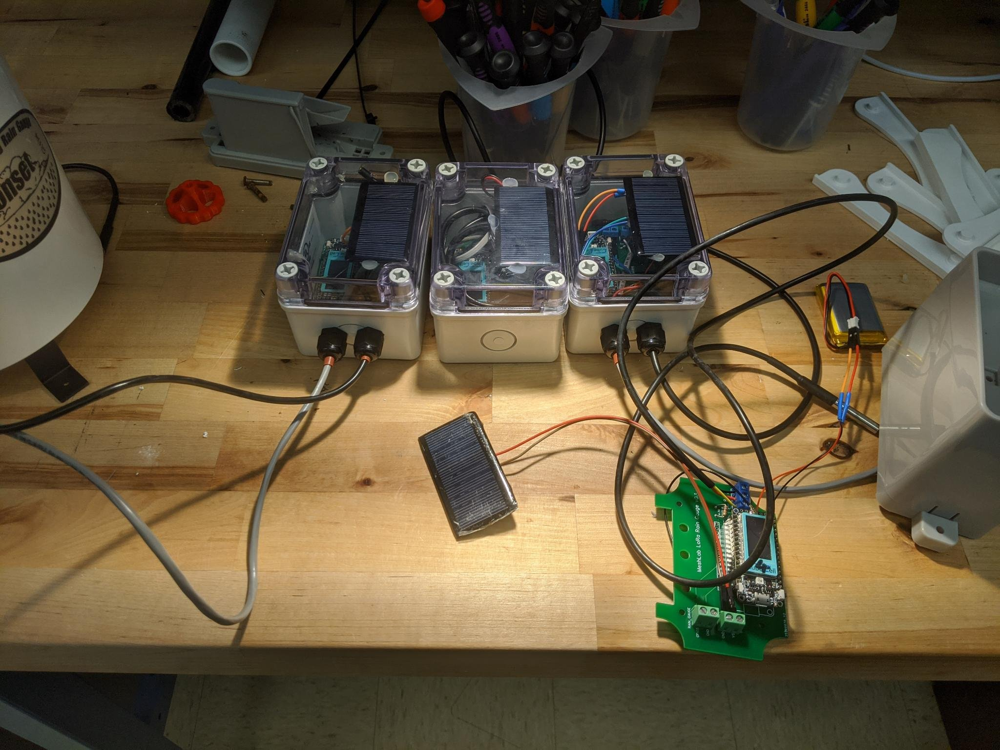

# Printed Circuit Board

This section briefly describes the PCBs designed within this project. While
breadboards[^bread] are often used for prototyping with microcontroller, real
deployments should use custom PCBs since they offer a more reliable setup.

The project scope required a rain gauge sensor as well as a temperature sensor
to transmit measurements over LoRaWAN to a online database. With the below
described PCB it is possible to attach a *Heltec HTCC-AB02* as well as the two
sensors within minutes. 

## *Rain Box* PCB

{ align=right width=400px }

As mentioned above the two values *temperature* and *rain fall* were to be
collected and send to an online database. First prototypes using a breadboard
and a *Heltec HTCC-AB02* worked out as expected, so the same exact circuit was
transfered in a PCB. On the right side a picture of the PCB is shown. The labels
`RAIN_GAUGE`, `SOLAR_IN` and `ONE_WIRE_IN` contain screw terminals which allow
easy attaching of the sensor cables.

An EasyEda[^easyeda] project file is available
[here](../resources/static/rain-box_htcc-ab02-v0.3.zip) for customization or
ordering online.

The PCB has a custom cutting so it fits perfectly into the outdoor case
[PTK-18420-C][case] by *Bud Industries, Inc.*. Using cable glands it's possible
to connect external sensors.

A picture of an assembled *Rain Box* is shown below. The picture shows four
different setups of the rain gauges. 

* The **left box** has a [HOBO RG3 rain gauge][hobo]
* The **middle box** has only a [DS18B20 temperature sensor] is connected inside
  the box. This was done to measure the maximum daily temperature inside the
  box.
* The **right box** has both a temperature sensor and a [MISOL rain
  guage][misol] attached. By the time of writing (2021-09-16) the official
  vendor website is unreachable.
* In **front** is a PCB board without a box showing a connected *Heltec
  HTCC-AB02*.

## PCB Editor

To design PCBs a variety of tools is available. However the number of tools that
are both free as well as available on the three main platforms Windows, MacOSX
and Linux the only candidate was EasyEda[^easyeda].

It comes with a tight integration of the PCB vendor *JLCPCB* which offers both
creation of PCBs and also soldering of selected components. For more complex
design this can be of use.

[^bread]: https://en.wikipedia.org/wiki/Breadboard
[^easyeda]: easyeda.com/
[case]: https://www.budind.com/product/nema-ip-rated-boxes/ptk-series-fiberglass-box/ptk-18240-2/#group=series-products&external_dimensions_group=0&internal_dimensions=0&cover_style_group=0
[hobo]: https://www.onsetcomp.com/products/data-loggers/rg3/
[ds18b20]: https://www.adafruit.com/product/381
[misol]: https://www.amazon.com/MISOL-Spare-weather-station-measure/dp/B00QDMBXUA/
