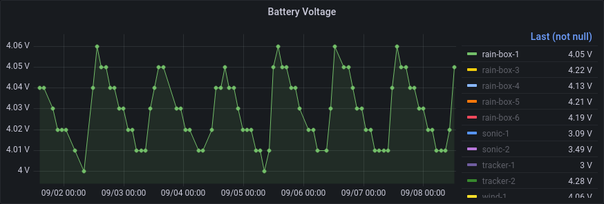

# Grafana Dashboard

Presenting collected data is important to make them accessible and give an
overview of events before starting in-depths analytics. While multiple
approaches to visualize data exists, this section describes the setup of
Grafana.

The advantages of Grafana compared to other solutions is the fact that without
any coding skills appealing graphs and gauges can be created, offering a live
and interactive user interface.

Within this setup the combination with the [InfluxDB database](influxdb.md) is
described, however it is possible to visualize [other data sources][datasources]
via Grafana.

[datasources]: https://grafana.com/docs/grafana/latest/datasources/

## Installation

To allow a cheap and reproducible setup these steps are done on a RaspberryPi
running [Raspbian], which allows low cost data hosing without requiring any
server setups. However it is equally possible to run this on a virtual machine
or even a laptop for testing.

The Raspbian ports of Grafana are outdated and therefore the official
Grafana repository is used instead:

```bash
echo "deb https://packages.grafana.com/oss/deb stable main" | \docs
	sudo tee -a /etc/apt/sources.list.d/grafana.list 
wget -q -O - https://packages.grafana.com/gpg.key | sudo apt-key add -
sudo apt update
sudo apt install -y grafana-rpi
```

More details on the Grafana installation steps are available in the official
[documentation][grafana-debian].

## Adding InfluxDB as data source

This setup run both Grafana as well as InfluxDB on a single RaspberryPi.
Therefore it's possible to access the data locally. Other setups may use remote
database on distributed systems, where data is stored on different machines than
visualized.


InfluxDB runs per default on port `8086` and if running, is available on
`localhost`. None of the extra options need to be activated since a local setup
doesn't require extra authentication settings except the login credentials set
in the [InfluxDB database](influxdb.md) setup.


## Configure a graphs

A generic manual to add graphs or *panels* is provided by the Grafana Project
itself within their [documentation][panel].

This example describes how to get the battery voltage of all available nodes.
A running InfluxDB receives data via *Telegraf*, feeding a MQTT stream into the
time series database. If using the same options as in the InfluxDB section,
Grafana will present a `mqtt_consumer` table from which data can be selected.

Since the [CayenneLPP](/resources/cayennelpp) protocol is used to encode senor
data for LoRaWAN transmission, all fields in the table follow a specific schema:

```
uplink_message_decoded_payload_<cayennelpp_type>_<cayennelpp_id>
```

All metrics start with `uplink_message_decoded_payload` since that contains
transmissions from the node. Other fields may contain IDs of used gateways or
transmission quality (`uplink_message_rx_metadata_0_rssi`), however these are
more relevant to monitor the nodes *health*.

The field of our interest is voltage with the ID `1`, the field is therefore
called as follows:

```
uplink_message_decoded_payload_voltage_1
```

Once the field is selected measurements should be *grouped by* the device IDs.
Grouping by means that a graph is created per device instead of showing all data
in a single graph. The *tag* for grouping is called `end_device_ids_device_id`.

Lastly to improve readability it is possible to assign an *alias* to each graph.
Instead of having the lengthy full description[^1] of a measurement only the
device identifier can be shown. To do so the special value
`$tag_end_device_ids_device_id` is added to the *alias* field.


[^1]: `mqtt_consumer.uplink_message_decoded_payload_voltage_1 {end_device_ids_device_id: rain-box-6}`


[panel]: https://grafana.com/docs/grafana/latest/panels/add-a-panel/

## Example Dashboard

Below is a screenshot of a demo setup which includes two graphs of measured
metrics (rain fall and temperature) and below an overview of the nodes over the
last week. It is possible to interactively select smaller and bigger time frames
and see precise values for specific times and dates.


Aboves two graphs show rain events that happened at different location in
Honolulu, Hawaii. It's possible to zoom into specific time ranges to see the
total amount of rain for that day, hour or minute.

The temperature graph below the *rain fall* shows a repeating pattern of
temperature changes. Two special cases are handled in this graph showing where
`rain-box-1` shows the *inner enclosing temperature* and `rain-box-6` is
stationed in a cooled lab, therefore the constantly low temperature.

Additional values can be measured to track the *health* of sensors, most
importantly the battery voltages and connection quality (*RSSI*).




The graph above shows how the battery voltage is dropping every night but
recharged on sunrise.


On the contrary, above graphs show that the node `sonic-2` doesn't recharge via
it's attached solar panel and therefore shuts off once the battery voltage is to
low for further LoRa transmissions. The node need manual inspection and
probably a solar panel replacement.


The graph above shows shows the varying values of RSSI, which describes the
connection quality. For LoRa values down to **-120dB** are fine for a stable
connection, so the node `rain-box-1` should have a stable connection.

[raspbian]: https://www.raspberrypi.org/downloads/raspbian/
[grafana-debian]: https://grafana.com/docs/grafana/latest/installation/debian/
