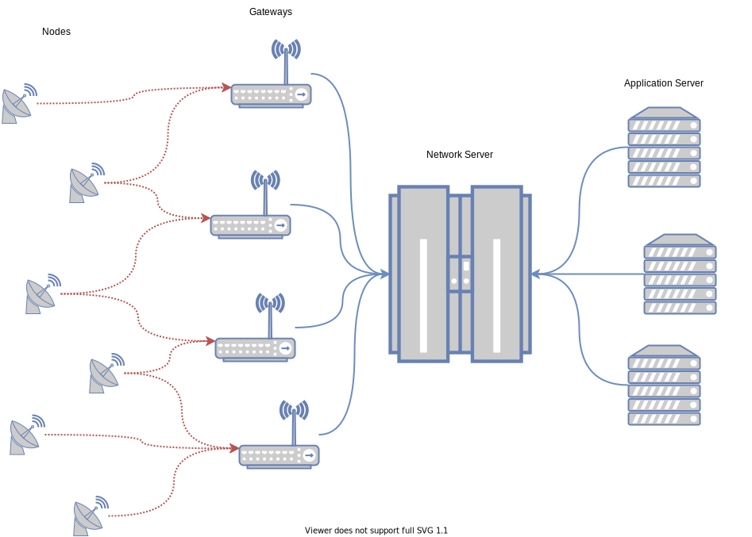
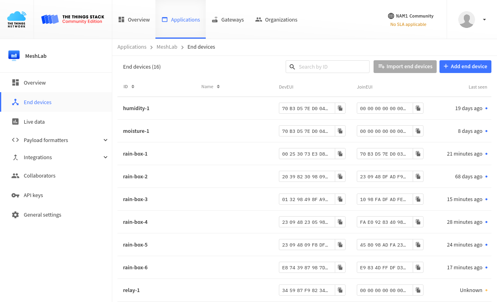
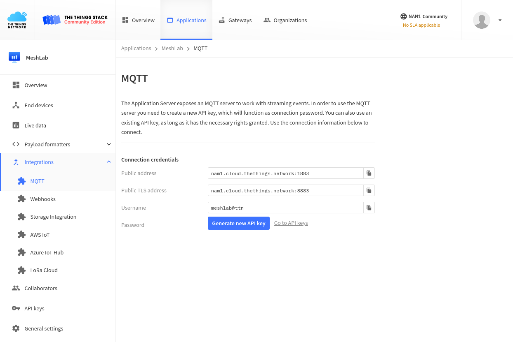

# LoRaWAN

This section gives a brief introduction to *LoRaWAN* and how it builds on top of
the radio frequency modulation called *LoRa*.

In short LoRaWAN offers a secure transport for data between sensor nodes
collecting metrics and a user controlled backend. The illustration below shows
the stack.



Sensor **Nodes** collect data and send it via LoRa radio frequency modulation
(red lines) to **Gateways**. A gateway has a LoRa compatible radio module and
antenna attach and listens for incoming messages. Once received, messages are
forwarded to a broker or **Network Server**. The network server, in this setups
case thethingsnetwork.org, manages user accounts and **applications**. Each
application has multiple **Nodes** assigned with individual login credentials.
Forwarded messages from gateways are offered via [MQTT] to user of specified
application. User controlled **Application Servers** can listen to MQTT streams
and store sensor data for further processing.

No user can access applications of other users and all traffic, starting from
sensor nodes until the application server is encrypted. This allows a federation
of infrastructure since multiple entities can share access to a single gateway
without being able to manipulate each others data.

As an outcome, both private hobbyists and institutions like universities can
offer gateway access and thereby work together to cover large areas. Different
projects don't have to manage their infrastructure independently but can share
gateways. Since all traffic is encrypted and authenticated as defined by the
LoRaWAN standard, no code has to be written by users to allow secure
connections.

Lastly multiple integrations allow even easier setups than described within this
document. Instead of running a self managed database, it is also possible to
rely on cloud services storing MQTT messages and offering convenient interfaces.

## TheThingsNetwork broker

The cloud service requires a free online account and the setup of an
**Application**. Each application then contains multiple **End devices** which
which provide sensor data. Received data is offered via an MQTT API can should
be consumed by a user controlled database, in this setup [InfluxDB](influxdb.md)
or one of the integrations.



The above image shows currently active end devices, their identifiers as well as
the time of the last received message.



Aboves picture shows the MQTT login credentials which can be either used within
the InfluxDB setup to have *Telegraf* listen to MQTT and store data or for other
applications.

Below is a short Python script called `mqtt2json.py` which listens to the MQTT
stream and outputs lines of JSON which can be consumed by other applications.  A
generic script like this allows custom downstream handling of incoming sensor
data. As proof of concept the script below is parsed by another tool adding
measurements to a SQL database and visualize them via a custom web
page[grogdata]. Nodes are identified via the `from` field and all payload is
stored in the `p` field, containing data fields based on
[CayenneLPP](/resources/cayennelpp).

[grogdata]: https://grogdata.soest.hawaii.edu/staging/nodepage/node-301/
[mqtt]: https://mqtt.org

```python
--8<-- "mqtt2json.py"
```

Below is an example output of the script which could be read by future tooling
using the *JSON Lines* standard[^jsonlines]

[^jsonlines]: https://jsonlines.org/

```
{"from": "rain-box-5", "p": {"temperature_1": 23.1}}
{"from": "rain-box-1", "p": {"temperature_1": 23.5}}
{"from": "sonic-2", "p": {"distance_1": 4.991}}
{"from": "rain-box-6", "p": {"temperature_1": 21.4}}
{"from": "rain-box-4", "p": {"digital_out_1": 2, "voltage_1": 4.15}}
{"from": "sonic-2", "p": {"distance_1": 5}}
{"from": "rain-box-5", "p": {"digital_out_1": 2, "voltage_1": 4.22}}
{"from": "sonic-2", "p": {"distance_1": 5}}
{"from": "rain-box-4", "p": {"temperature_1": 24.7}}
{"from": "rain-box-5", "p": {"temperature_1": 23.6}}
{"from": "rain-box-1", "p": {"temperature_1": 23.6}}
{"from": "sonic-2", "p": {"distance_1": 5}}
{"from": "rain-box-6", "p": {"temperature_1": 21.5}}
{"from": "rain-box-3", "p": {"temperature_1": 24.1}}
{"from": "sonic-2", "p": {"distance_1": 5}}
{"from": "sonic-2", "p": {"distance_1": 5}}
{"from": "rain-box-4", "p": {"temperature_1": 24.6}}
{"from": "rain-box-5", "p": {"temperature_1": 23}}
{"from": "rain-box-1", "p": {"temperature_1": 23.7}}
...
```
